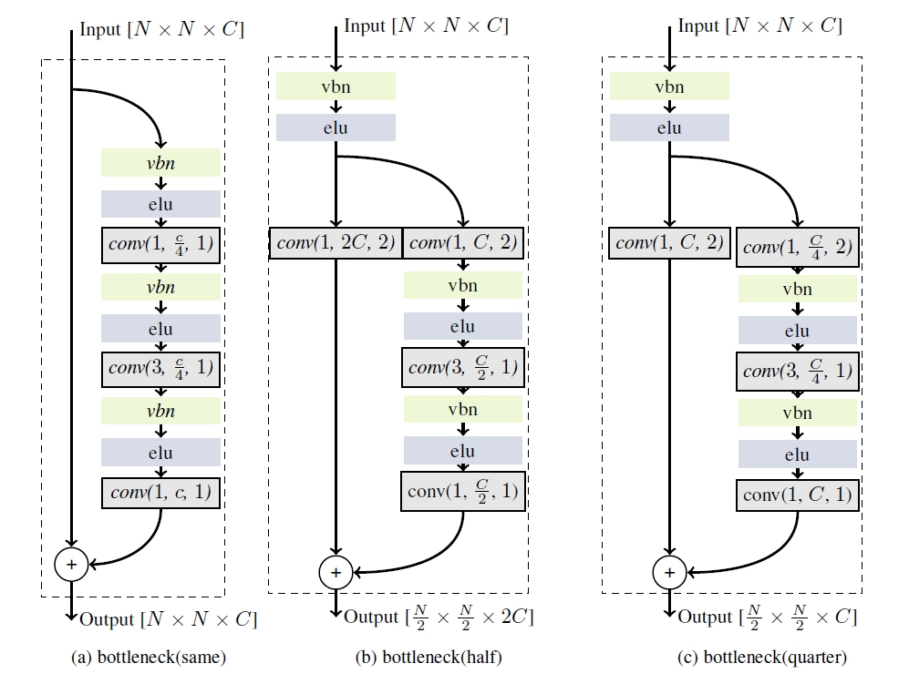

# denosing autoencoder for Mnist

## Brief introduction
The main_mnist.py is a demo. Before you run this code, you have to change the dataset path.

The block I use can be found in paper <a href="https://arxiv.org/abs/1512.03385" >Deep Residual Learning for Image Recognition</a>.

 
 

the test of the network is shown below, apprently, it's not good enough.

 
 

